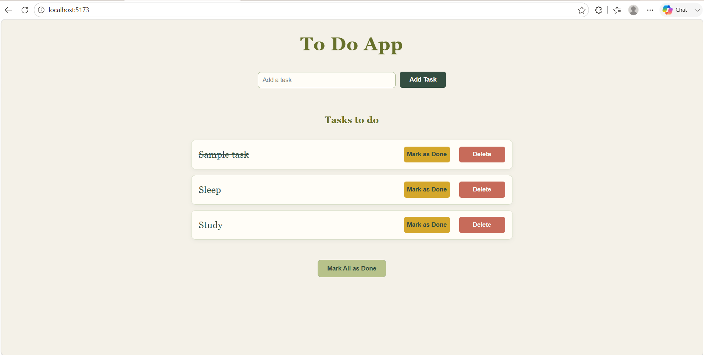

# 📝 To Do App

A simple and responsive **To Do application** built with **React**.
This project allows users to add, complete, and delete tasks through a clean and user-friendly interface.

---

## ✨ Features

* ➕ **Add Tasks** — Create new tasks quickly.
* ✅ **Mark as Done** — Mark individual tasks as completed.
* ☑️ **Mark All as Done** — Complete all pending tasks at once.
* 🗑️ **Delete Tasks** — Remove tasks from the list.
* 🚫 **Empty Task Validation** — Prevents empty tasks from being added.
* 🆔 **Unique Task IDs** — Uses UUID to generate unique IDs.
* 🎨 **Modern UI** — Clean design with an earthy color palette.
* 📱 **Responsive Design** — Works across different screen sizes.

---

## 🛠️ Technologies Used

| Technology    | Purpose                       |
| ------------- | ----------------------------- |
| ⚛️ React      | Building the user interface   |
| 🟨 JavaScript | Application logic             |
| 🎨 CSS        | Styling and responsive design |
| ⚡ Vite        | Development and build tool    |
| 🆔 UUID       | Generating unique task IDs    |

---

## 📂 Project Structure

```text
todo-app/
│
├── 📁 public/
│
├── 📁 src/
│   ├── 📄 App.jsx
│   ├── 📄 TodoList.jsx
│   ├── 🎨 TodoList.css
│   └── 📄 main.jsx
│
├── 📁 screenshots/
│   └── 🖼️ todo-app.png
│
├── 📄 .gitignore
├── 📄 eslint.config.js
├── 📄 index.html
├── 📄 package.json
├── 📄 package-lock.json
├── 📄 vite.config.js
└── 📄 README.md
```

---

## 🚀 Getting Started

### 📋 Prerequisites

Before running the project, make sure you have:

* 🟢 [Node.js](https://nodejs.org/) installed
* 📦 npm installed
* 🐙 Git installed

### 📥 Clone the Repository

Clone the project using Git:

```bash
git clone https://github.com/Kirti391/todo-app.git
```

### 📁 Navigate to the Project

```bash
cd todo-app
```

### 📦 Install Dependencies

```bash
npm install
```

### 🆔 Install UUID

If UUID is not already included in your dependencies:

```bash
npm install uuid
```

### ▶️ Start the Development Server

```bash
npm run dev
```

Vite will provide a local development URL in the terminal. Open that URL in your browser to view the application.

Usually:

```text
http://localhost:5173
```

---

## 🧠 How It Works

The application uses React's `useState` hook to manage the list of tasks.

Each task is stored as an object:

```javascript
{
    task: "Sample task",
    id: "unique-task-id",
    isDone: false
}
```

### ➕ Adding a Task

The user enters a task in the input field and clicks **Add Task**.

A new task is added with a unique ID generated using UUID.

### ✅ Completing a Task

Clicking **Mark as Done** changes the selected task's `isDone` value to `true`.

Completed tasks are displayed with a strikethrough effect.

### 🗑️ Deleting a Task

Clicking **Delete** removes the selected task from the list.

### ☑️ Completing All Tasks

The **Mark All as Done** button marks every task as completed.

---

## 🎨 Design

The application uses a soft, earthy color palette.

| UI Element          | Color     |
| ------------------- | --------- |
| 🌿 Background       | `#F4F1E8` |
| 🫒 Heading          | `#66702A` |
| 🌲 Main Text        | `#344E41` |
| 🌱 Input Border     | `#A3B18A` |
| ➕ Add Task          | `#344E41` |
| ✅ Mark as Done      | `#D4A72C` |
| 🗑️ Delete          | `#C76B5A` |
| ☑️ Mark All as Done | `#B7C28A` |

---

## 📸 Screenshot

<p align="center">
  
</p>

---

## 🔮 Future Improvements

* ✏️ Edit existing tasks
* 💾 Save tasks using `localStorage`
* 🔍 Search tasks
* 🔎 Filter tasks by status
* 📊 Display completed and pending task counts
* 🏷️ Add task categories
* 📅 Add task due dates
* 🌙 Add dark mode
* 🔃 Add drag-and-drop task sorting

---

## 🤝 Contributing

Contributions are welcome!

1. 🍴 Fork the repository
2. 🌿 Create a new branch
3. ✏️ Make your changes
4. 💾 Commit your changes
5. 🚀 Push your branch
6. 🔃 Create a Pull Request

---

## 📄 License

This project is open source and available under the **MIT License**.

---

## 👨‍💻 Author

**Kirti**

Built with ❤️ using **React**.

⭐ If you like this project, consider giving the repository a star!
